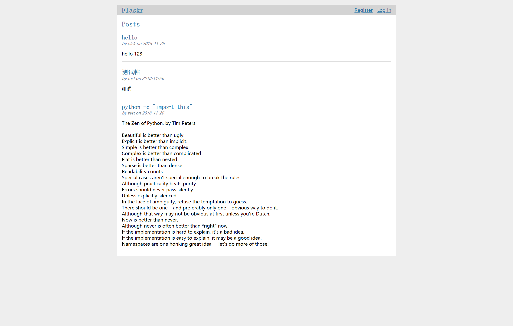

# flask_tutorial

本教程中我们将会创建一个名为 Flaskr 的具备基本功能的博客应用。应用用户可以 注册、登录、发贴和编辑或者删除自己的帖子。可以打包这个应用并且安装到其他电脑上。

<li class="toctree-l1"><a class="reference internal" href="https://dormousehole.readthedocs.io/en/latest/tutorial/index.html">教程</a><ul>
<li class="toctree-l2"><a class="reference internal" href="https://dormousehole.readthedocs.io/en/latest/tutorial/layout.html">项目布局</a></li>
<li class="toctree-l2"><a class="reference internal" href="https://dormousehole.readthedocs.io/en/latest/tutorial/factory.html">应用设置</a></li>
<li class="toctree-l2"><a class="reference internal" href="https://dormousehole.readthedocs.io/en/latest/tutorial/database.html">定义和操作数据库</a></li>
<li class="toctree-l2"><a class="reference internal" href="https://dormousehole.readthedocs.io/en/latest/tutorial/views.html">蓝图和视图</a></li>
<li class="toctree-l2"><a class="reference internal" href="https://dormousehole.readthedocs.io/en/latest/tutorial/templates.html">模板</a></li>
<li class="toctree-l2"><a class="reference internal" href="https://dormousehole.readthedocs.io/en/latest/tutorial/static.html">静态文件</a></li>
<li class="toctree-l2"><a class="reference internal" href="https://dormousehole.readthedocs.io/en/latest/tutorial/blog.html">博客蓝图</a></li>
<li class="toctree-l2"><a class="reference internal" href="https://dormousehole.readthedocs.io/en/latest/tutorial/install.html">项目可安装化</a></li>
<li class="toctree-l2"><a class="reference internal" href="https://dormousehole.readthedocs.io/en/latest/tutorial/tests.html">测试覆盖</a></li>
<li class="toctree-l2"><a class="reference internal" href="https://dormousehole.readthedocs.io/en/latest/tutorial/deploy.html">部署产品</a></li>
<li class="toctree-l2"><a class="reference internal" href="https://dormousehole.readthedocs.io/en/latest/tutorial/next.html">继续开发！</a></li>
</ul>
</li>

我的实现：https://github.com/law52525/flask_tutorial

